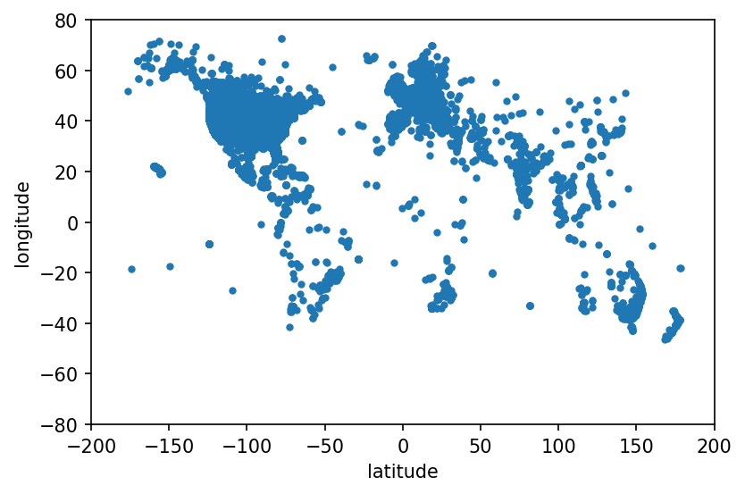
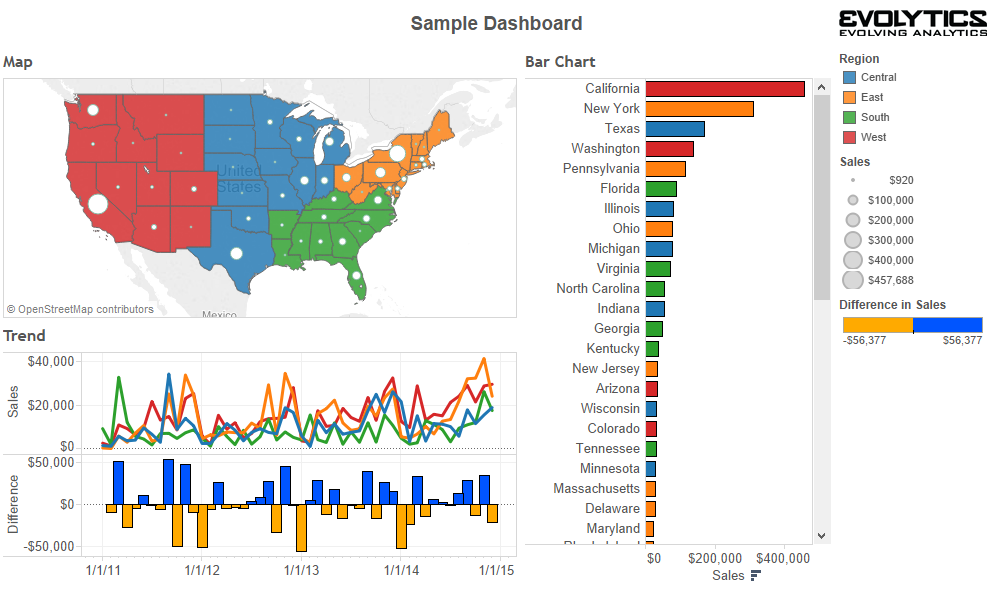

## Reminder: change of modalities today

Topics:
 * announcements
 * short lecture about linked data
 * some brief Lab #5 hints
 * rest of time used to ask questions about Lab #5

---

## Where we are: Last week

notes: last week in the recording we started playing with dashboarding using some randomly generated data in bqplot

we also started working with the Grammar of Graphics and used bqplot declaratively to start "painting" scales and axis on our canvas

we also talked about different viz engines and you got to look at this in the HW

---

## Where we are: Today

notes: 

Today we'll continue with bqplot and work on building up dashboards

if we have time we'll also start talking about map projections this week (but we might only get to it next week)

---

## Today's Main Lecture Topics

 1. Interactivity and linked views
 1. More dashboarding
 1. Dashboards with maps

---

 
 
 

# TOPIC 1: Interactivity

---

## Interactivity

This week, we'll talk about some more basics principles of interactivity in
visualization.

What do you think of when you think of interactive visualizations?

---

## Interactivity: Parameters

<!-- .slide: data-background-image="images/brushlink_01.svg" data-background-size="80% auto" data-background-position="right 50% bottom 50%" -->

 * Point characteristics
 * Axis limits/bounds
 * Transform/scale

note: we'll think a little about different ways to manipulate each of these types of plot characteristics

---

## Interactivity: Parameters

<!-- .slide: data-background-image="images/brushlink_01.svg" data-background-size="80% auto" data-background-position="right 50% bottom 50%" -->

 * Point characteristics - Click-and-drag
 * Axis limits/bounds - Rectangle zoom
 * Transform/scale - Adjustment

---

## Interactivity: Linking & Brushing

<!-- .slide: data-background-image="images/brushlink_02.svg" data-background-size="80% auto" data-background-position="right 50% bottom 50%" -->

`data(variable1, variable2, variable3, variable4)`

note: here we are plotting a set of data that is a function of 4 variables.

For example, this could be the amount you are late to class as a function of (1) how much sleep you got, (2) how excited you are about the topic that day (3) how nervous you are about the topic that day and (4) how much of your homework the dog ate.

here we are plotting 2 2d plots of this dataset - were we know intuitively each point is represented both as a dot on the first graph *and* as a dot on the 2nd graph

---

## Interactivity: Linking & Brushing

<!-- .slide: data-background-image="images/brushlink_02.svg" data-background-size="80% auto" data-background-position="right 50% bottom 50%" -->

`data(variable1, variable2, variable3, variable4)`

`filter( variable2 > variable1 )`

note: now we are going to think about applying a simple filter, based around the first plot

we'll only show data where variable2 > variable1

---

## Interactivity: Linking & Brushing

<!-- .slide: data-background-image="images/brushlink_03.svg" data-background-size="80% auto" data-background-position="right 50% bottom 50%" -->

`data(variable1, variable2, variable3, variable4)`

`filter( variable2 > variable1 )`

note: lets draw a line where the demarkation of our filter would be

---

## Interactivity: Linking & Brushing

<!-- .slide: data-background-image="images/brushlink_04.svg" data-background-size="80% auto" data-background-position="right 50% bottom 50%" -->

`data(variable1, variable2, variable3, variable4)`

`filter( variable2 > variable1 )`

note: ... and lets take out all the data of both plots that has variable2 <= variable1

---

## Interactivity: Linking & Brushing

<!-- .slide: data-background-image="images/brushlink_05.svg" data-background-size="80% auto" data-background-position="right 50% bottom 50%" -->

note: we can also select regions in our linked view

---

## Interactivity: Linking & Brushing

<!-- .slide: data-background-image="images/brushlink_06.svg" data-background-size="80% auto" data-background-position="right 50% bottom 50%" -->

note: here are how these points are linked in the plot of variable3 vs variable4

---

## Interactivity: Linking & Brushing

<!-- .slide: data-background-image="images/brushlink_07.svg" data-background-size="80% auto" data-background-position="right 50% bottom 50%" -->

note: so when we select with our brush in the first plot we can show what is selected in the second plot

---

## Interactivity: Linking & Brushing with UFO data

note: as a "practical" example, we can for example make cuts in things like the
duration of UFO sitings for all years

---

## Interactivity: Linking & Brushing with UFO data

note: we can select only the longest sitings

---

## Interactivity: Linking & Brushing with UFO data

note: this is how this plot would now look

---

## Interactivity: Linking & Brushing with UFO data

note: and then we can see how the map changes

this is our original

---

## Interactivity: Linking & Brushing with UFO data

note: this is how this dataset looks now w/o the shortest duration ufo sitings

---

## Interactivity: Linking & Brushing with UFO data

As a dashboard:

<!-- .slide: class="two-floating-elements" -->

  

 

notes:
as a dashboard, this process would look something like this where we have the duration in seconds on the left "driving" changes in the lat/long points shown on the right

---

## Interactivity: Linking & Brushing with UFO data

As a dashboard:

<!-- .slide: class="two-floating-elements" -->

  

 

notes:

our user would then select a threshold they wanted to cull the data by

---

## Interactivity: Linking & Brushing with UFO data

As a dashboard:

<!-- .slide: class="two-floating-elements" -->

  

 

notes:

and those changes would propagete to our right-hand plot through a data "linkage", thus allowing our user to have multiple views of this dataset

---

<iframe width="1024" height="576"
src="https://www.youtube.com/embed/B7XoW2qiFUA?rel=0" frameborder="0"
allow="autoplay; encrypted-media" allowfullscreen></iframe>

[Link to video](https://www.youtube.com/embed/B7XoW2qiFUA)

note: here is one of the first examples of a "linked view" visualization machine.  We won't watch this whole video, but
if you are interested, they talk about how they can "interact" with different views

this was developed by SLAC (stanford linear accelerator)

prim9 = picturing, rotation, isolation & masking in up to 9 dimensions - for looking at multidimensional datasets
this was developed for particle data (so, like x,y,z and vx,vy,vz might be of interest)

*pause recording here!*

---

## Implementing This

Two main approaches to the selection process:

 * Concurrent filtering ("masks")
 * Index-based selection (i, j - based)

What are the pros and cons of each?

What are methods of showing "linked" and "brushed" data if you have:

 * Scatter plot
 * Histogram
 * Field / image plot

notes: 
hint -- we already discussed index based last class with the grid heatmap and the histogram plots

and we've done masking before with the filtering of images AND there are more hints in the recording you all watched before this class

---

 
 
 

# TOPIC 2: Dashboarding

---

## Pre-class Video's Python Programming:

We progressively build a dashboard for the UFO dataset using the following steps:

 * Create heat maps of the sightings in the UFO dataset
 * Select based on location (do not use map marks yet)
 * Manually create "bins" for aggregation (**this is "pre-done" for us**)
 * Use different scales for dates, times, locations

And build up a _dashboard_ for our data.

notes:
in the prep notebook, it is shown how the histogramming is done, however for timing purposes we'll just use a function

---

## Dashboards: Tableau

notes: so here is an example of a dashboard, I *think* from Tableau.  Here we see a linked view which
displays data in several different ways to give the user the ability to visualize what their data
means spatially (with the map & region bargraph) and temporally (with the calendar/bar view at the bottom)

---

## Dashboards: Glueviz

note: aside, there are opensource dashboarding type software, this is an example of glueviz that is
used a lot in astronomy and built on python

This is an example of binning light (dark or bright pixels) in an image of a star forming region (I think),
and linking this with a histogram which responds to a selection tool (in red) in the image.

---

## Dashboards: Building our own in Python

Why bother?

notes: so, given that there is dashboarding software out there, why would be bother going through the difficulty of doing it ourselves?

---

## Dashboards: Building our own in Python

Why bother?
 * Understand choices about data formatting/missing data

notes: the first reason is that we can learn a bit about what choices we make for "messy" data

---

## Dashboards: Building our own in Python

Why bother?
 * Understand choices about data formatting/missing data
 * Understand necessary data transformations

notes: next, we can learn a bit about how data is transformed to make it dash-boardable

---

## Dashboards: Building our own in Python

Why bother?
 * Understand choices about data formatting/missing data
 * Understand necessary data transformations
 * Understand data links

notes: also we want to understand the ways we can actually link parts of our data together -- what choices do we make to link data like this?

if we use dashboarding software, it can often obfuscate a lot of of these aspects

---

## Lab \#5 hints

notes:
* so as discussed last week, 5.1 is basically just a walk through of what we did in class but feel free to check out the prep notebook for more info
* 5.2 is some practice doing pivot tables so its suggested you do this next 
* 5.3 is based on things that we went over in the video for this week, this combines ideas from 5.1 & 5.2 so save this for last

