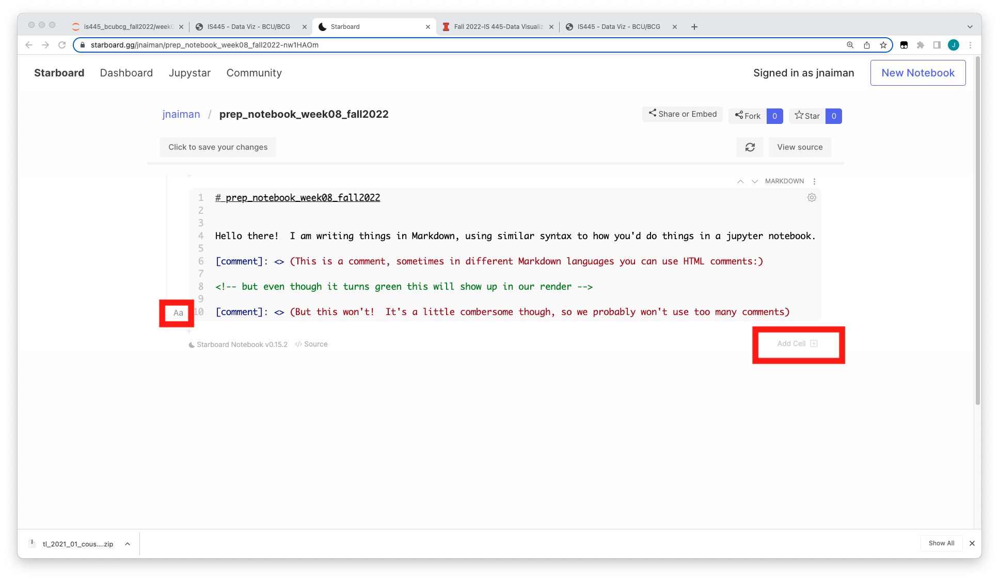
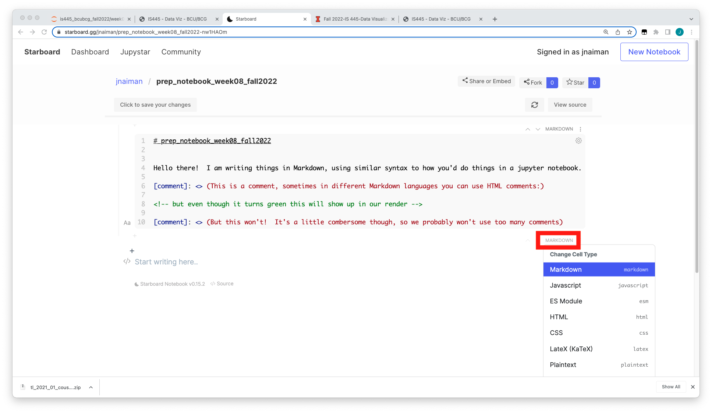

<br>
<br>
<br>

# TOPIC 2: Intro to Vega/Vega-lite

---

## Engines

Thus far we have used `bqplot` as our primary declaritive method, but we'll start looking at `vega-lite` this week

 * `bqplot` - both imperative & declaritive methods
 * `vega-lite` - declaritive

---

## vega-lite

vega-lite is a high-level method for describing visualizations independently of
their data.

We will be exploring this using [Straemlit](https://streamlit.io/) in [HuggingFace](https://huggingface.co/docs/hub/en/spaces-sdks-streamlit).

You can also use `vega-lite` directly with the online editor at:

https://vega.github.io/editor/

---

## vega-lite in context - Web Viz

 * Tools and frameworks covered
    * ipywidgets
    * bqplot
 * Intro to Web Viz
    * (Sort of) How the web works
    * (Very, very) Basic javascript
    * vega-lite

notes:
First we'll review a bit about what we've already done using bqplot

Then we'll have a *very* hand-wavy intro to how javascript/web dev works

---

## Status Update: What's Left

Today, we are introducing the *second to last* major tool we will use: [vega-lite](https://vega.github.io/vega-lite/).

After this: [Jekyll](https://jekyllrb.com/) + [Altair](https://altair-viz.github.io/index.html) & Javascript dev within

---

## bqplot review

Declarative:

 * Construct `Figure` objects from `Mark` objects.
 * Relate points to each other with `Scale` objects, display them using `Mark` objects that are keyed to a set of `Scale` objects, and
 * Apply interaction using `ipywidgets` and `traitlets`.

---

## bqplot objects

 * A mark is some mechanism for displaying data.  For example, we might have
   data that has a set of x and y values, which we can use `Lines` to
   represent.
 * `Scale` objects describe relationships between visual attributes (position)
   and data values.
 * `Axis` objects are where data are placed.
 * `Figure` objects contain marks and axes, as well as interaction.
 
notes:
a quick reminder about our grammar of graphics objects

---

## bqplot: Very Simple

Here is a reminder about that sort of basic setup:

```#python
import bqplot
import numpy as np

# 1. Data
x = np.arange(100)
y = np.random.random(100) + 5

# 2. Scales
x_sc = bqplot.LinearScale()
y_sc = bqplot.LinearScale()

# 3. Axis
ax_x = bqplot.Axis(scale = x_sc, label = 'X value')
ax_y = bqplot.Axis(scale = y_sc, label = 'Y value', orientation = 'vertical')

# 4. Marks
lines = bqplot.Lines(x = x, y = y, scales = {'x': x_sc, 'y': y_sc})

# Finally: figure
fig = bqplot.Figure(marks = [lines], axes = [ax_x, ax_y])
display(fig)
```

---

## More bqplot

With bqplot, we construct a set of objects that are related:

 * Scales
 * Axes
 * Marks
 * Figures
 * Interactions

---

## Scales

`bqplot` provides several scales we can utilize:

 * `LogScale`
 * `LinearScale`
 * `DateScale`
 * `OrdinalScale`
 * `ColorScale`
 * A few more as well.

([documentation](https://bqplot.readthedocs.io/en/latest/_generate/bqplot.scales.Scale.html))

---

## Marks

bqplot has several different marks we can explore.  We have utilized a few:

 * `HeatMap`
 * `GridHeatMap`
 * `Bars`
 * `Graph`

([documentation](https://bqplot.readthedocs.io/en/latest/_generate/bqplot.marks.Mark.html))

---

## bqplot interaction

As noted in the previous class, bqplot widgets are all based on ipywidgets.  This
means we use the same systems for describing the two.

We add an interaction to a given figure via the `interaction` keyword argument
to a figure.

---

## bqplot interactors

We have used several of these different interaction methods:

 * `FastIntervalSelector`
 * `IndexSelector`
 * `BrushIntervalSelector` & `BrushSelector`
 * `MultiSelector` 
 * `LassoSelector`
 * `HandDraw`
 * `PanZoom`
 * `Tooltip`

---

## The Web: A *very* hand-wavy overview

 * Content is transmitted from point-to-point (PPP)
 * Content can be manipulated locally or remotely
 * Not all servers can manipulate data before sending

notes:
this will be an EXTREMELY hand wavy overview

PPP just is a fancy way of saying a communcations protocol that supports transmision between two routers w/ or w/o any host - https://en.wikipedia.org/wiki/Point-to-Point_Protocol

---

## Your Browser

 * Your browser contains -- essentially -- an entire operating system.  It can
   manage:
    * Display mechanisms
    * Interaction with you, the user
    * Input/output from files and file-like objects
    * Interpreter to execute code
 * Most of its activities are mediated via a [document object model (DOM)](https://www.w3schools.com/js/js_htmldom.asp) and
   the programming language Javascript

---

## Things to Note

 * Javascript is "garbage collected"
 * Javascript is [single-threaded](https://dev.to/steelvoltage/if-javascript-is-single-threaded-how-is-it-asynchronous-56gd)
 * Asynchronous programming can be a real noodle-bender (good news is we already handled this with `bqplot` callbacks!)

notes:
here "garbage collected" just means JS handles memory management - we don't have to explicitly allocate and deallocate regions in memory for variables

the "garbage collector" is basically the part of JS that goes and figures out what memory to release

"single-threaded" means that code executes in order, except ...

"asynchronous" means that *some* code gets handed off some code to the browser to be excecuted "in the background" - when the browser is finished, the tasks are "returned" -- we essentially already did thsi with some of our "on_change" and "on_click" stuff with bqplot!

---

## Document Object Model

The Document Object Model (DOM) is how we interact with the collection of HTML
objects in our document.

For instance, a page can be composed of `<div>` objects, `<p>` objects, etc,
and we can construct and interact with these.  This includes things like
modifying style sheets.


(See, for example, the
[jsfiddle](https://jsfiddle.net/) for [jQuery
boilerplate](https://jsfiddle.net/boilerplate/jquery) ).

notes:

for example, we can specify the layout of a document in HTML with different components like the header, title, and body

the body will have different elements like `<div>` and `<a>`, etc.

---

## Document Object Model

The Document Object Model (DOM) is how we interact with the collection of HTML
objects in our document.

For instance, a page can be composed of `<div>` objects, `<p>` objects, etc,
and we can construct and interact with these.  This includes things like
modifying style sheets.


One alternative is to have rendering tied to data and data
values, and to have those automatically update as needed -- `vega-lite`.

---

## Synchronous programming

In Python, we would fetch a website and wait for that to finish before we move
on.

```
import requests

r = requests.get("https://google.com/")
print(r.text)
print("Request completed!")
```

---

## Asynchronous programming

In Javascript, we would tell the code to fetch, but we would also tell it what
to do *after* it finished.

This uses jQuery, but you can [do it without
that](http://youmightnotneedjquery.com/#json).

```
$.get("https://google.com/", function(data, status){
      alert("Data: " + data + "\nStatus: " + status);
});
console.log("Hey, I've done the thing.");
```

Note that you can't always get this to work. In fact, that example won't even
work!

---

## Async and Event-Driven

Async is how we can think about event driven programming, as well.  We have
done this using `traitlets` and `ipywidgets` using callbacks in Python, and we will do it here
as well.

```
var button = $("button");

button.on("click", function() {
    console.log("I've been clicked!");
});
```

---

## Basic Javascript

We will go over a few things, and then move on to vega-lite.

We'll use JavaScript mostly to "wrap" vega-lite around HTML elements.

```
var myArray = [1, 2, 3, 4];
var myString = "Hello there!";
var myConcatString = "Hi " + "there " + 5;
var myObject = {'a': 1, 'b': 2, 'c': [1, 2, 3, 4]};
```

---

# HERE

* starboard was week 9 & 10
* jekyll was week 11, 12, 13 (and in theory 15, but I think we didn't work on it)

* vega lite syntax basics -- example
* example showing how it works with a div element
* go through a few examples with the vega-editor -- say this can be useful for debugging (example)
* then copy one to altair to show that
* then go through a few examples in altair that we have w/o interactivity
* then do streamlit
* then do streamlit to huggingface
* then do altair + interactivity (?) --> streamlit(?)
* then jekyll + altair

---

## vega-lite editor

https://vega.github.io/editor/

notes:
we'll start by making a quick plot in the vega-lite editor

**open the vega-editor and spend some time with examples!!!**

---

## vega-lite syntax: basics

From the vega-lite examples, you can make a bar chart that is an aggregate like so:

```
{
  "$schema": "https://vega.github.io/schema/vega-lite/v3.json",
  "data": {"url": "data/movies.json"},
  "mark": "bar",
  "encoding": {
    "x": {
      "bin": true,
      "field": "IMDB_Rating",
      "type": "quantitative"
    },
    "y": {
      "aggregate": "count",
      "type": "quantitative"
    }
  }
}
```

Data available [list is here](https://github.com/vega/vega-datasets/tree/master/data).

notes:
here, we just specify what version of vega-lite we are using

then specify where the data is (this is stored on the vega-lite github of this schema)

then say we are making a "mark" of a "barplot"

then say what we are 

---

## vega-lite syntax

There are several mechanisms by which we describe data representations in
`vega-lite`, but the overarching principle is that it is *declarative*.  We define
what it does based on what we say we want it to look like.

The place where this is no longer true is when we modify `datum` values.

---

## vega-lite syntax

The syntax you will need to be the most familiar with:

 * `mark`: how to visually represent something
 * [`encoding`](https://vega.github.io/vega-lite/docs/encoding.html): the translation between data and the mark
 * `aggregate`: operating over a collection of points -- `mean`, `sum`, `median`,
   `min`, `max`, `count` (next week)
 * `filtering`: for plotting subsets of data (next week)
 * `type`: `quantitative`, `temporal`, `ordinal`, `nominal`, `geojson`

---

## Streamlit goes here!!

Or do we start with Vega-lite/Altair?

---

<br>
<br>
<br>

# TOPIC 3: Starboard

---

## Starboard

[A quick intro to Starboard](https://starboard.gg/)


notes:
**DO**
 * starboard.gg -- the intro notebook
 * also at starboard.gg - the Data Viz in JS and Pandas & Matplotlib intro notebooks -- say we will go over this together, but if you want a quick peak
 * note that now the inclass and prep notebooks will be online versions hosted by starboard!
 
**come back here for more after!!**

---

## [Starboard](https://starboard.gg/) Tips & Tricks




notes:
Starboard is a newer system and so there are some things that are a bit fiddly and we should be aware of.

One is that the "add cell" button is on the right and is a little hard to see.

Also, to add text, you have to click on the little button on the left to modify text or code blocks.

---

## [Starboard](https://starboard.gg/) Tips & Tricks




notes:
You can the type of the cell into things like markdown/JS/Python, etc on the left dropdown as well

---

## [Starboard](https://starboard.gg/) Tips & Tricks


Autosave is **NOT** a feature of Starboard notebooks!


notes:
one, potentially super annoying thing is that Starboard does not auto-save your work -- make sure you click that save button frequently!!

also also, if you didn't sign up for an account yet, and you do that like, NOW we won't ding you for being late on the assignment ;)

For the jekyll part -- **take the temperature of the class**


