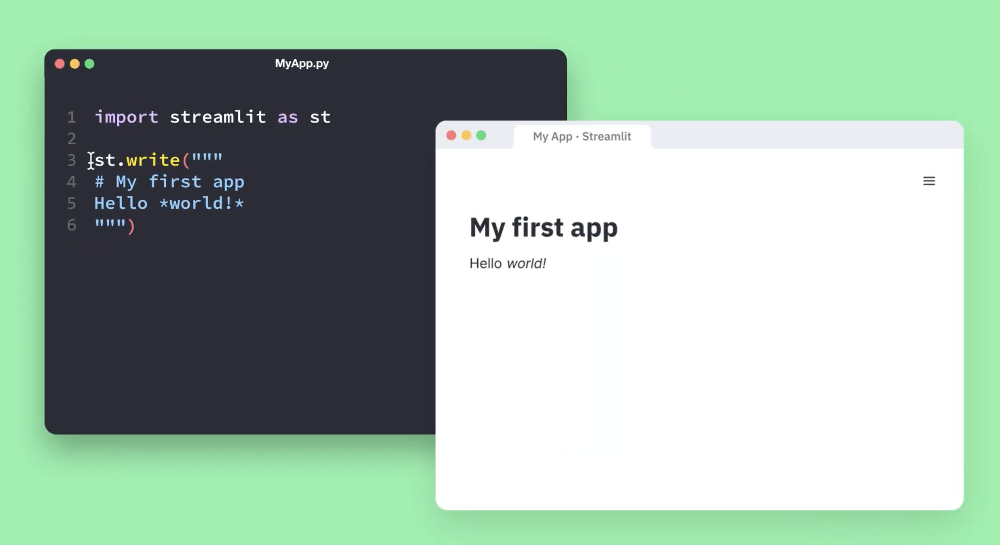

## Altair

```javascript

brush = alt.selection_interval(encodings=['x','y'])

chart1 = alt.Chart(mobility_url).mark_rect().encode(
    alt.X("Student_teacher_ratio:Q", bin=alt.Bin(maxbins=10)),
    alt.Y("State:O"),
    alt.Color("count()")
).properties(
   height=400
).add_params(
        brush
)

chart2 = alt.Chart(mobility_url).mark_bar().encode(
    alt.X("Mobility:Q", bin=True,axis=alt.Axis(title='Mobility Score')),
    alt.Y('count()', axis=alt.Axis(title='Mobility Score Distribution'))
).transform_filter(
    brush
)

chart = (chart1.properties(width=300) | chart2.properties(width=300))

chart
```

notes:
just some reminders for what we worked on last time -- mostly with altair and making some initial dashboards

---

## Altair in Streamlit (and Jekyll)

```javascript

brush = alt.selection_interval(encodings=['x','y'])

chart1 = alt.Chart(mobility_url).mark_rect().encode(
    alt.X("Student_teacher_ratio:Q", bin=alt.Bin(maxbins=10)),
    alt.Y("State:O"),
    alt.Color("count()")
).properties(
   height=400
).add_params(
        brush
)

chart2 = alt.Chart(mobility_url).mark_bar().encode(
    alt.X("Mobility:Q", bin=True,axis=alt.Axis(title='Mobility Score')),
    alt.Y('count()', axis=alt.Axis(title='Mobility Score Distribution'))
).transform_filter(
    brush
)

chart = (chart1.properties(width=300) | chart2.properties(width=300))

chart
```

How can we share our creations with the public?

notes:
so we can make some cool things but how can we share them with our audience?

we'll discuss how to do this with Streamlit (and later Jekyll)

---

## Streamlit

[Streamlit](https://streamlit.io/) is a way to write "apps" in a Python script that can be hosted on the web.



notes:
where we see a simple example from the video linked above showing how Markdown as a string in Python is translated into headers and text on a page.

---

## HuggingFace

[HuggingFace](https://huggingface.co/) is the platform that we'll be using to host our interactive apps.


notes:
have folks heard of huggingface?

huggingface is a place where folks can share code/datasets and also host apps 

---

## Spaces on HuggingFace

<iframe src="https://huggingface.co/spaces?sort=trending&search=streamlit"></iframe>

---

## Streamlit in HuggingFace


