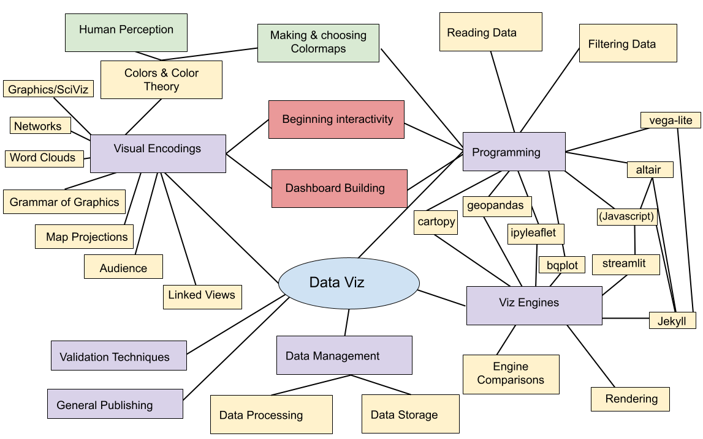
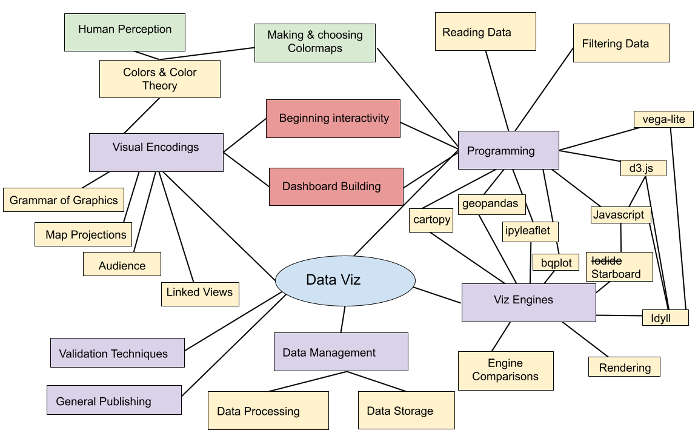
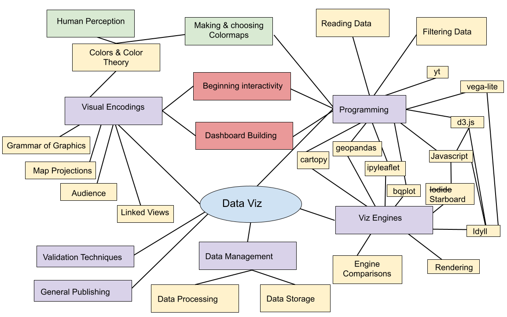

 
 
 

# You made it!

---

## This course

notes:
Look at all the stuff we covered!

---

## Extra credit: Network Viz

notes:
keep in mind that we have an extra credit assignment, worth 1 homework grade, that is in this week's page

also recall that the maximum you can get on the homework is 100% of that category, so if you have a perfect HW score, you can't do better than that!

---

## Notes on Final, Part 3

Due dates:
 1. First draft of Part 3 -- due Dec 8th, will get feedback course participants
 1. Post your link in the Moodle forum to get feedback from classmates
 1. Provide feedback for 3 randomly assigned classmates -- due Dec 12th
 1. Final chance to resubmit your Part 3 -- due Dec 14th (placeholder submission link)
 
**Please be aware these are hard deadlines**
 
notes:
go to pages!!

because we have to get grades in by a certain time, these due dates are hard ones -- no extensions.

your "first" part 3 submission CAN be a work in progress -- you can outline what you want to do, but the more you have done, the better we can give you feedback and the more there is for your other feedback-giving classmates to work with

notes:
first I'm gonna start with some resource of where to go from here

---

 
 
 

# TOPIC 1: Where to go from here

notes:
different sub-fields of dataviz will lead you down different pathways

---

## Python

 * See whats in dev on the [bqplot gitter lobby](https://gitter.im/bloomberg/bqplot)
 * More about volume rendering with [ipyvolume](https://ipyvolume.readthedocs.io/en/latest/)
 * More about sciviz dev with [yt slack](https://yt-project.slack.com/join/shared_invite/enQtMzQ4Nzk1Mjk0ODY4LWNmOTFiNTM4N2ExZWYyY2YwZDUxN2Q1MTgwNDdjZGExMWM0Y2VlNzUzNGExZTZhMWRlNjU3ZjFmZmU3MjdkNDg)

notes:
these are notes

---

## Javascript

 * [Beginning Javascript course](https://www.codecademy.com/learn/introduction-to-javascript)
 * See what's in dev on the [Idyll gitter lobby](https://gitter.im/idyll-lang/Lobby) - including updates to vega-lite!

---

## Courses

 * [Advanced Data Visualization, iSchool](https://ischool.illinois.edu/degrees-programs/courses/is590adv)
 * [Museum Informatics](https://ischool.illinois.edu/degrees-programs/courses/is426)
 * [Data Science Storytelling](https://ischool.illinois.edu/degrees-programs/courses/is590dst)
 * [More on sciviz and graphics](https://jnaiman.github.io/csci-p-14110_su2020/) (Not UIUC, includes intro to programming)

---

## Also, don't forget to fill out your ICES forms!

---

## Last time

notes: 

Just as a reminder of all of the things we've covered up an until this point! Last time we covered a little bit about scientific visualization...

---

## This week (pre-recorded material)

notes: 

This week we'll cover a little more on SciViz in some pre-recorded material and focus on our in-class time on working on final project stuff

---

## Announcements and Reminders: Final Project, Part 2

**Dashboard element** is required (i.e. like Lab 4) -- with a "driver" plot driving changes to an "updating/reaction" plot.

---

## Announcements and Reminders: Final Project, Part 3.2

**ALL** group members are expected to post a link in the "Open Discussion Forum".

*This portion of the final is graded individually.*

notes:
**go to this assignment!**

---

## Announcements and Reminders: Final Project, Part 3.3

Feedback individuals have been assigned -- **see Final Project, Part 3.3**.

*This portion of the final is graded individually.*

notes:
**go to this assignment!**

point out the "what to do if you can't find your person" text

---

## Announcements and Reminders: Change of Modalities Week 15 & 16

Weeks 15 & 16 will have some pre-recorded materials for the extra credit assignments (SciViz, Network Viz, Text Viz).

There will be short lectures and the rest of the time we'll have space to work on your Final Projects.

notes:

we'll also "talk" more about this in Week 15 with some pre-recorded materials and an extra credit optional assignment on scientific viz

---

## Announcements and Reminders: Extra Credit Assignments

*No extensions.*

*MAX Homework score is 45%.*

notes:
keep in mind that we have 2 extra credit assignments

also recall that the maximum you can get on the homework is 100% of that category, so if you have a perfect HW score, you can't do better than that!

---

## Announcements and Reminders: Part 3

Due dates:
 1. First draft of Part 3 -- due Dec 1, will get feedback course participants 
 1. Post your link in the Canvas forum to get feedback from classmates -- Dec 2 (**all group members must do this**)
 1. Provide feedback for 3 randomly assigned classmates -- due Dec 8
 1. Final chance to resubmit your Part 3 -- Dec 11
 
**Please be aware these are hard deadlines -- no extensions available**
 
notes:
go to pages!!

because we have to get grades in by a certain time, these due dates are hard ones -- no extensions.

your "first" part 3 submission CAN be a work in progress -- you can outline what you want to do, but the more you have done, the better we can give you feedback and the more there is for your other feedback-giving classmates to work with

be aware that the due dates have shifted a little bit -- the first draft of your final part 3 has moved up, but the final submission has moved back -- this is so that you'll have plenty of time to get feedback and give feedback to others.

